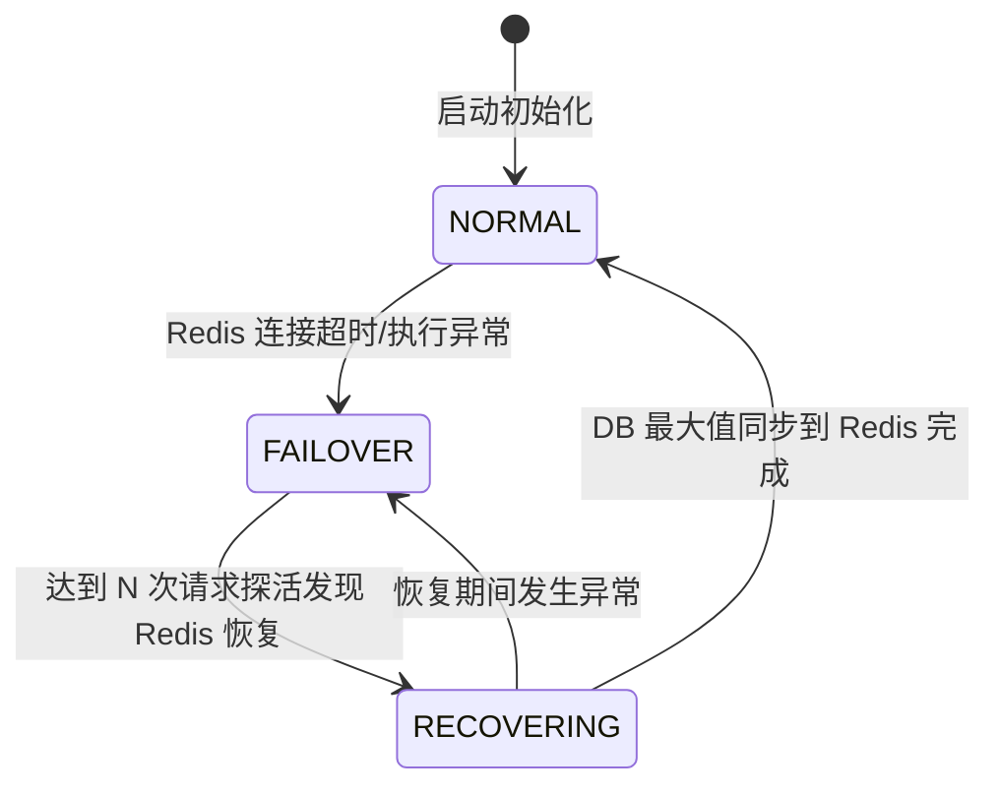
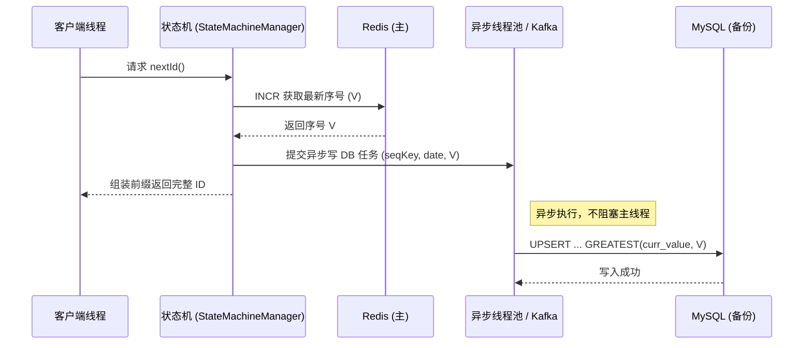
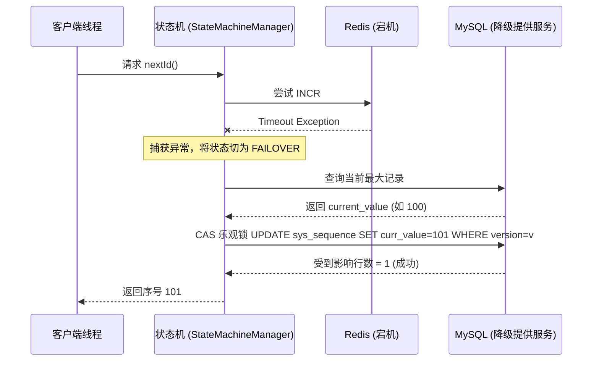
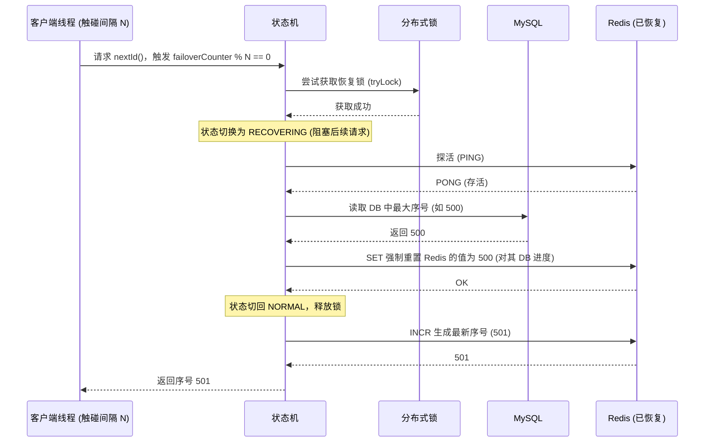

# SequenceGenerator

[SequenceGenerator](file:///Users/jixu/Project/Java/SequenceGenerator/src/main/java/com/yourorg/sequence/core/SequenceGenerator.java#26-84) 是高并发有序顺序号生成中间件的核心对外暴露接口。调用方只需注入此接口即可获取顺序号，无需关心底层 Redis / DB 的状态机流转与降级逻辑。

接口根据业务需求分为**两大模式**，共计 6 个核心方法：

1. **日期模式（完整 ID）**：`业务前缀 + 日期 + 补齐序号`，每日重置。
2. **永久模式（纯序号）**：仅需`递增序号`，永不重置，永久无极递增。

---

## 一、 日期模式（每日重置的完整 ID）

**核心特征：**
* **返回格式**：`{前缀}{yyyyMMdd}{补齐序号}` (例如: `ORDER20260319001`)
* **重置周期**：**按天重置**（每天的序号从头开始计算）
* **底层机制 (Redis)**：Key = `seq:{seqKey}:{yyyyMMdd}`，带有过期时间 (TTL, 默认48小时)。
* **底层机制 (DB降级)**：主键 `curr_date` 为当天实际日期（如 `2026-03-19`）。

### 1. [nextId(String seqKey)](file:///Users/jixu/Project/Java/SequenceGenerator/src/main/java/com/yourorg/sequence/core/SequenceGenerator.java#30-37)
**功能**：使用**指定**的业务前缀生成下一个完整的带日期的顺序号。
```java
/**
 * @param seqKey 业务标识（如 "ORDER", "USER"）
 * @return 例子：ORDER20260319001
 */
String nextId(String seqKey);
```

### 2. [nextId()](file:///Users/jixu/Project/Java/SequenceGenerator/src/main/java/com/yourorg/sequence/core/SequenceGenerator.java#30-37)
**功能**：使用**默认**业务前缀生成下一个完整的带日期的顺序号。（默认前缀在 `application.yml` 中通过 `sequence.generator.prefix` 配置）。
```java
/**
 * @return 例子：SEQ20260319001
 */
String nextId();
```

---

## 二、 永久模式（不按日重置的纯递增序号）

**核心特征：**
* **返回格式**：纯数字递增序号。可以定长补齐为字符串 (如 `"001"`)，也可以是原始数值 (如 `1L`)。
* **重置周期**：**永不重置，永久递增**。
* **底层机制 (Redis)**：Key = `seq:{seqKey}`，**无日期后缀，不设置过期时间 (TTL)**。
* **底层机制 (DB降级)**：主键 `curr_date` 使用**固定的哨兵日期 `9999-12-31`**，确保与日期模式共享同一张表的结构而互相不干扰。

### 3. [nextValue(String seqKey)](file:///Users/jixu/Project/Java/SequenceGenerator/src/main/java/com/yourorg/sequence/core/StateMachineManager.java#78-82)
**功能**：使用**指定**的业务标识，生成**永久递增、并在左侧定长补齐**的字符串序号。
```java
/**
 * @param seqKey 业务标识（如 "USER_SN"）
 * @return 例子："001", "002" ... "999", "1000"
 */
String nextValue(String seqKey);
```

### 4. [nextValue()](file:///Users/jixu/Project/Java/SequenceGenerator/src/main/java/com/yourorg/sequence/core/StateMachineManager.java#78-82)
**功能**：使用**默认**的业务标识，生成**永久递增并定长补齐**的字符串序号。
```java
/**
 * @return 例子："001"
 */
String nextValue();
```

### 5. [nextRawValue(String seqKey)](file:///Users/jixu/Project/Java/SequenceGenerator/src/main/java/com/yourorg/sequence/core/StateMachineManager.java#95-100)
**功能**：使用**指定**的业务标识，获取**最原始的永久递增 long 类型数值**。
**适用场景**：调用方不需要中间件进行格式化，而是希望拿到 `long` 数值后用自己的特定规则进行组合转换（如转化为36进制，或者进行雪花算法的位移）。
```java
/**
 * @param seqKey 业务标识（如 "USER_SN"）
 * @return 例子：1, 2, 3...
 */
long nextRawValue(String seqKey);
```

### 6. [nextRawValue()](file:///Users/jixu/Project/Java/SequenceGenerator/src/main/java/com/yourorg/sequence/core/StateMachineManager.java#95-100)
**功能**：使用**默认**的业务标识，获取最原始的永久递增 `long` 类型数值。
```java
/**
 * @return 例子：1, 2, 3...
 */
long nextRawValue();
```

---

## 三、 使用示例汇总

假设在 `application.yml` 中的配置如下：
```yaml
sequence:
  generator:
    prefix: JX        # 默认前缀
    seq-length: 4     # 补齐长度 4 位
```

在 2026 年 3 月 19 日当天的调用结果对比：

| 调用方法 | 内部业务标识 | 是否带有日期 | 是否按天重置 | 输出结果示例 |
|---|---|---|---|---|
| [nextId("ORDER")](file:///Users/jixu/Project/Java/SequenceGenerator/src/main/java/com/yourorg/sequence/core/SequenceGenerator.java#30-37) | `ORDER` | ✅ 是 (`20260319`) | ✅ 是 | `"ORDER202603190001"` |
| [nextId()](file:///Users/jixu/Project/Java/SequenceGenerator/src/main/java/com/yourorg/sequence/core/SequenceGenerator.java#30-37) | `JX` (默认) | ✅ 是 (`20260319`) | ✅ 是 | `"JX202603190001"` |
| [nextValue("VIP")](file:///Users/jixu/Project/Java/SequenceGenerator/src/main/java/com/yourorg/sequence/core/StateMachineManager.java#78-82)| `VIP` | ❌ 否 | ❌ 否 (永久递增) | `"0001"` (第1次), `"0002"` |
| [nextValue()](file:///Users/jixu/Project/Java/SequenceGenerator/src/main/java/com/yourorg/sequence/core/StateMachineManager.java#78-82) | `JX` (默认) | ❌ 否 | ❌ 否 (永久递增) | `"0001"` (第1次), `"0002"` |
| [nextRawValue("PAY")](file:///Users/jixu/Project/Java/SequenceGenerator/src/main/java/com/yourorg/sequence/core/StateMachineManager.java#95-100)|`PAY` | ❌ 否 | ❌ 否 (永久递增) | `1` (类型为 long), `2` |

---

## 四、 底层数据存储对照参考

为您排查问题时参考：

**Redis 层面：**
* 完整 ID 对应的 Redis Key: `seq:ORDER:20260319` (有 TTL 过期时间)
* 纯序号 对应的 Redis Key: `seq:VIP` (无过期时间，永不失效)

**MySQL DB 降级层面 (`sys_sequence` 表)：**
| seq_key | curr_date | curr_value | version | 说明 |
|---------|-----------|------------|---------|------|
| ORDER   | 2026-03-19 | 15         | 15      | [nextId("ORDER")](file:///Users/jixu/Project/Java/SequenceGenerator/src/main/java/com/yourorg/sequence/core/SequenceGenerator.java#30-37) 产生的降级/同步记录 |
| VIP     | 9999-12-31 | 582        | 582     | [nextValue("VIP")](file:///Users/jixu/Project/Java/SequenceGenerator/src/main/java/com/yourorg/sequence/core/StateMachineManager.java#78-82) 产生的降级/同步记录，日期为固定哨兵值 |


---

# 序列号生成器 (Sequence Generator) 配置说明

## 1. 快速接入

在您的 [pom.xml](file:///Users/jixu/Project/Java/SequenceGenerator/pom.xml) 中引入由于本工程打出的 Starter 包后，无需提供任何 `@Bean`，所有的客户端都可以直接注入 [SequenceGenerator](file:///Users/jixu/Project/Java/SequenceGenerator/src/main/java/com/jixu/sequence/core/DbSequenceGenerator.java#22-124)。

```java
import com.jixu.sequence.core.SequenceGenerator;
import org.springframework.beans.factory.annotation.Autowired;

@Service
public class OrderService {
    
    @Autowired
    private SequenceGenerator sequenceGenerator;
    
    public void createOrder() {
        // 使用默认前缀生成带日期的单号: JX20260319001
        String orderNo = sequenceGenerator.nextId();
    }
}
```

## 2. 接口定义

整个组件暴露了 **2 种模式**、共计 **6 个方法** 供业务使用。

### 2.1 日期重置模式 (完整 ID)

**特点**：按日重置序号，Redis Key 每天过期。
**存储结构**：`{前缀}{yyyyMMdd}{补齐序号}` (如："ORDER20260319001")

* [nextId(String seqKey)](file:///Users/jixu/Project/Java/SequenceGenerator/src/main/java/com/jixu/sequence/core/StateMachineManager.java#68-72): 使用自定义的前缀和业务标识（如 `ORDER`）。
* [nextId()](file:///Users/jixu/Project/Java/SequenceGenerator/src/main/java/com/jixu/sequence/core/StateMachineManager.java#68-72): 使用 [application.yml](file:///Users/jixu/Project/Java/SequenceGenerator/src/main/resources/application.yml) 里 `sequence.generator.prefix` 配置的默认前缀。

### 2.2 永久递增模式 (纯序号)

**特点**：Redis 序号永不过期，DB 中的日期采用统一的哨兵值 `9999-12-31`，序号长期累加。

* [nextValue(String seqKey)](file:///Users/jixu/Project/Java/SequenceGenerator/src/main/java/com/jixu/sequence/core/StateMachineManager.java#84-88): 返回**补齐好**的定长字符串序号。如："001", "002"。
* [nextValue()](file:///Users/jixu/Project/Java/SequenceGenerator/src/main/java/com/jixu/sequence/core/StateMachineManager.java#84-88): 使用默认业务标识，返回补齐的序号字符串。
* [nextRawValue(String seqKey)](file:///Users/jixu/Project/Java/SequenceGenerator/src/main/java/com/jixu/sequence/core/StateMachineManager.java#101-106): 返回**原始未格式化**的 `long` 类型的序号，如 `1L, 2L`。
* [nextRawValue()](file:///Users/jixu/Project/Java/SequenceGenerator/src/main/java/com/jixu/sequence/core/StateMachineManager.java#101-106): 使用默认标识返回原始 `long` 序号。

## 3. 核心配置 [application.yml](file:///Users/jixu/Project/Java/SequenceGenerator/src/main/resources/application.yml) 参数一览

```yaml
sequence:
  generator:
    # ------------------ 基础配置 ------------------
    prefix: JX                      # 默认的业务前缀 (nextId() 等空参方法使用)
    seq-length: 3                   # 序号补全位数，不足会用 0 填充 (如 001)
    recovery-interval: 100          # DB 降级态下，每隔多少次请求探活一次 Redis 是否恢复
    expire-seconds: 172800          # Redis Key 默认的过期时间 (48小时)
    max-retry: 5                    # DB 乐观锁自增在遇到冲突时的最大重试次数
    
    # ------------------ DB 同步配置 ------------------
    # 负责控制 Redis 主数据每次自增后，如何异步传递给 MySQL 作为防抖备份。
    # 可选值: THREAD_POOL 或 KAFKA
    sync-mode: THREAD_POOL
    
    # sync-mode = THREAD_POOL 时的专有配置
    thread-pool:
      core-size: 2                  # 线程池常驻核心线程数
      max-size: 8                   # 线程池最大上限
      queue-capacity: 2000          # 任务队列容量。打满后将降级由调用者线程直接入库，防丢失
      thread-name-prefix: seq-db-sync- 
      
    # sync-mode = KAFKA 时的专有配置 (注意：使用此模式必须确保 pom.xml 引入了 spring-kafka)
    kafka:
      topic: sequence-db-sync       # 生产者投递消息、消费者监听的共同 Topic
      group-id: sequence-sync-consumer # 消费者属组
```

## 4. 数据库降级核心表结构 (DDL)

如果您尚未创建防灾同步表，请在您配置的被连入的 MySQL 执行如下脚本：

```sql
CREATE TABLE IF NOT EXISTS `sys_sequence` (
    `seq_key`     VARCHAR(50)  NOT NULL COMMENT '业务标识，如：JX, ORDER',
    `curr_date`   DATE         NOT NULL COMMENT '当前日期，如：2026-03-19',
    `curr_value`  INT          NOT NULL DEFAULT 0 COMMENT '当前已使用的最大序列号',
    `version`     INT          NOT NULL DEFAULT 0 COMMENT '乐观锁版本号',
    `update_time` DATETIME     DEFAULT CURRENT_TIMESTAMP ON UPDATE CURRENT_TIMESTAMP COMMENT '最后更新时间',
    PRIMARY KEY (`seq_key`, `curr_date`)
) ENGINE=InnoDB DEFAULT CHARSET=utf8mb4 COMMENT='全局顺序号生成表';
```
---
# 高并发有序顺序号生成中间件 - 架构设计文档

## 1. 核心设计理念
本组件采用了 **"Redis 主生成 + DB 异步备份 + DB 乐观锁降级"** 的高可用架构设计。

* **极致性能**：正常情况下，所有的 ID 生成请求全部由 Redis 的 Lua 脚本（或 `INCR`）在内存中原子完成，无锁、无阻塞。
* **数据防丢**：生成序列号后，通过线程池（或 Kafka）异步将最新值同步到 DB 中（Upsert 记录最大值）。
* **平滑降级**：当 Redis 宕机时，系统瞬间切换为 DB 乐观锁自增模式，继续提供服务。由于 DB 一直在异步备份，所以降级时不会出现序列号回退。
* **安全恢复**：当探测到 Redis 恢复后，系统冻结所有请求，从 DB 中读取当前的最大序列号来初始化 Redis，确保恢复后也是严格递增的。

## 2. 核心状态机 (FSM) 设计

整个系统围绕三种状态进行运转：


## 3. 调用流程交互图

### 3.1 正常模式 (NORMAL) 序列号生成流转


### 3.2 降级模式 (FAILOVER) 序列号生成流转


### 3.3 恢复模式 (RECOVERING) 序列号生成流转


## 4. DB 同步策略 (DbSyncStrategy)

系统提供两种异步持久化 DB 的策略，可以通过 [application.yml](file:///Users/jixu/Project/Java/SequenceGenerator/src/main/resources/application.yml) 的 `sync-mode` 参数灵活切换：

### 4.1 线程池模式 (THREAD_POOL)
* **适用场景**：单体应用、大多数微服务、对外部依赖要求少的场景。
* **机制**：通过内置的有界队列线程池直接执行 `sys_sequence` 表的 Upsert 操作。
* **防丢机制**：线程池队列打满后，通过 `CallerRunsPolicy` 降级为同步执行，牺牲一点性能但绝对不丢数据。

### 4.2 消息队列模式 (KAFKA)
* **适用场景**：超高并发写、系统本身已重度依赖 Kafka 并希望复用它来做削峰。
* **机制**：Redis 拿到号后作为生产者将消息发入指定 Topic，由统一的 `@KafkaListener` 消费者进行写库。
* **乱序容忍**：DB 端采用 `ON DUPLICATE KEY UPDATE curr_value = GREATEST(curr_value, newValue)` 语法，无惧消息的乱序消费，只记录最大值。

