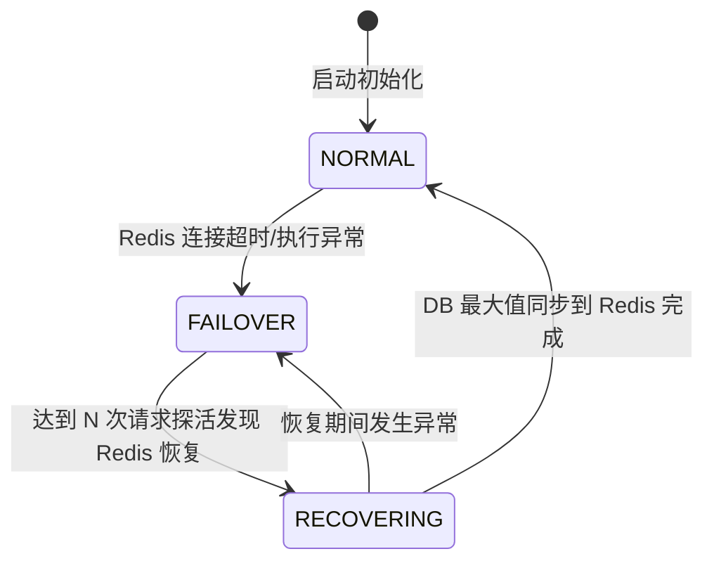
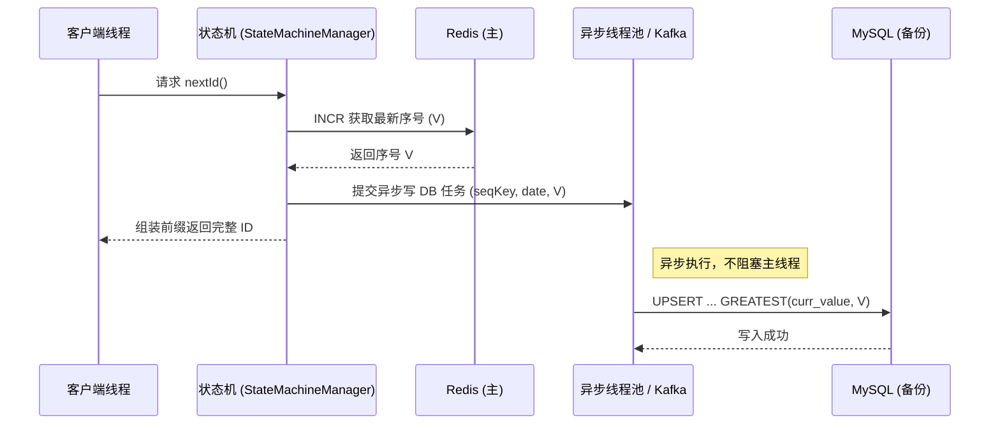
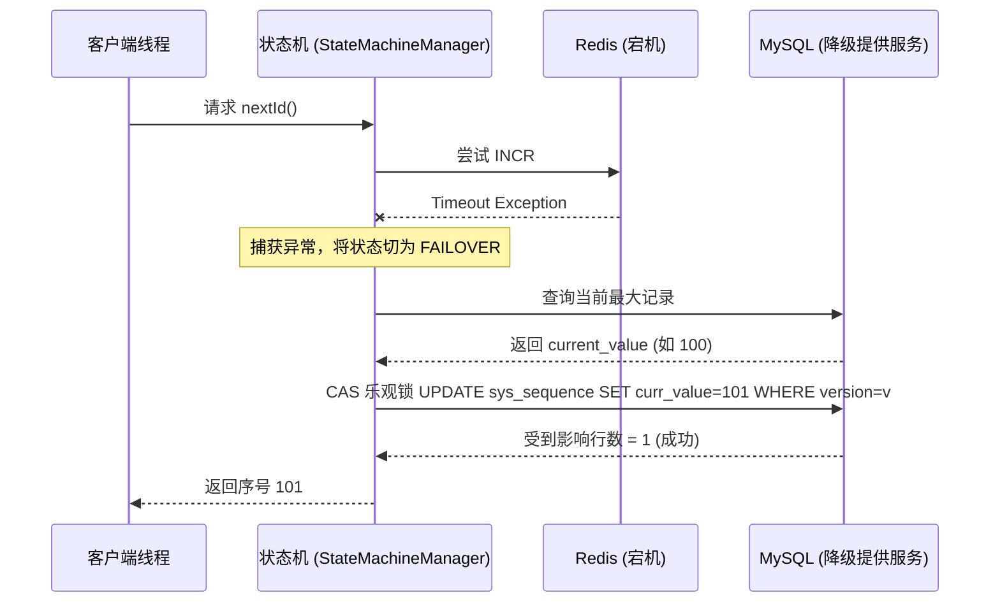
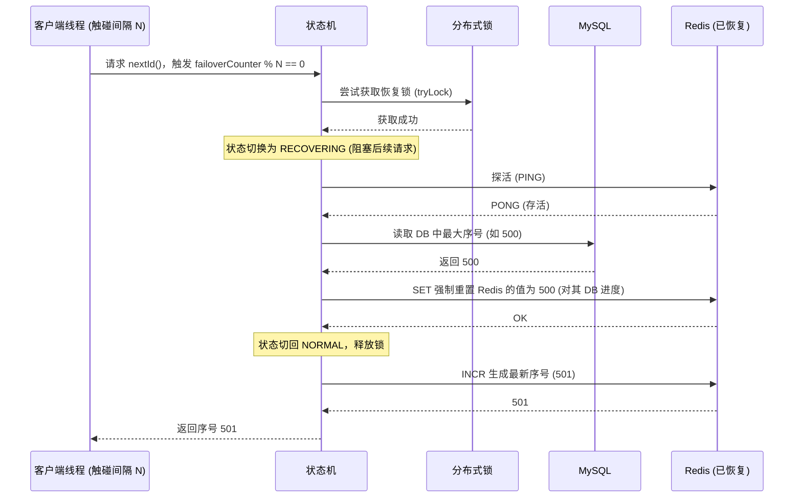

# 高并发有序顺序号生成中间件 - 架构设计文档

## 1. 核心设计理念
本组件采用了 **"Redis 主生成 + DB 异步备份 + DB 乐观锁降级"** 的高可用架构设计。

* **极致性能**：正常情况下，所有的 ID 生成请求全部由 Redis 的 Lua 脚本（或 `INCR`）在内存中原子完成，无锁、无阻塞。
* **数据防丢**：生成序列号后，通过线程池（或 Kafka）异步将最新值同步到 DB 中（Upsert 记录最大值）。
* **平滑降级**：当 Redis 宕机时，系统瞬间切换为 DB 乐观锁自增模式，继续提供服务。由于 DB 一直在异步备份，所以降级时不会出现序列号回退。
* **安全恢复**：当探测到 Redis 恢复后，系统冻结所有请求，从 DB 中读取当前的最大序列号来初始化 Redis，确保恢复后也是严格递增的。

## 2. 核心状态机 (FSM) 设计

整个系统围绕三种状态进行运转：

## 3. 调用流程交互图

### 3.1 正常模式 (NORMAL) 序列号生成流转

### 3.2 降级模式 (FAILOVER) 序列号生成流转

### 3.3 恢复模式 (RECOVERING) 序列号生成流转

## 4. DB 同步策略 (DbSyncStrategy)

系统提供两种异步持久化 DB 的策略，可以通过 [application.yml](file:///Users/jixu/Project/Java/SequenceGenerator/src/main/resources/application.yml) 的 `sync-mode` 参数灵活切换：

### 4.1 线程池模式 (THREAD_POOL)
* **适用场景**：单体应用、大多数微服务、对外部依赖要求少的场景。
* **机制**：通过内置的有界队列线程池直接执行 `sys_sequence` 表的 Upsert 操作。
* **防丢机制**：线程池队列打满后，通过 `CallerRunsPolicy` 降级为同步执行，牺牲一点性能但绝对不丢数据。

### 4.2 消息队列模式 (KAFKA)
* **适用场景**：超高并发写、系统本身已重度依赖 Kafka 并希望复用它来做削峰。
* **机制**：Redis 拿到号后作为生产者将消息发入指定 Topic，由统一的 `@KafkaListener` 消费者进行写库。
* **乱序容忍**：DB 端采用 `ON DUPLICATE KEY UPDATE curr_value = GREATEST(curr_value, newValue)` 语法，无惧消息的乱序消费，只记录最大值。
