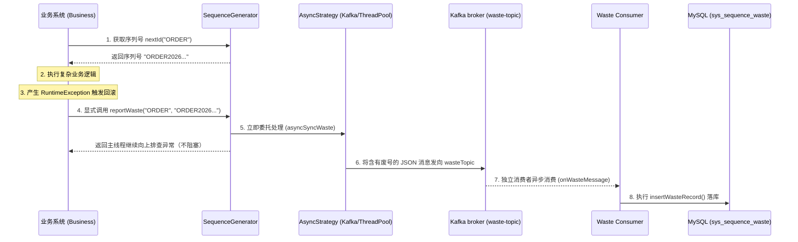

# 废弃序列号 (Waste Sequence) 异步补偿机制技术实现文档

## 1. 业务背景与痛点

在分布式高并发系统中，`SequenceGenerator` 通过 Redis `INCR` 指令实现了极致性能的全局唯一递增序列号生成。这种模式下，**序列号在请求通过 Redis 时就已经被消耗**。
当业务线程拿到序列号后，接下来的业务逻辑（如 RPC 调用、多表联查与更新操作）如果发生异常并触发了数据库事务回滚（`@Transactional rollback`），那么该笔业务的生命周期结束，但这枚已经被消耗的序列号便产生空洞（断号现象）。

**为什么不能直接将 Redis 中的序列号倒退回滚？**
因为系统同时存在大量并发请求。如果线程 A 回滚序列号，但在此期间线程 B、线程 C 已经使用了新的递增序列号，简单的倒推（Redis `DECR`）会直接破坏业务数据的严格有序性和时间轴，导致后续发号产生重复或乱序问题。

## 2. 解决方案：异步记录废号（允许断号与追踪并重）

为解决断号带来的追踪难题并保证高并发性能，我们引入了**“废弃序列号（废号记录）异步补偿机制”**。

这套方案设计的**核心原则**是：**只进不退、事务解耦、异步补偿**。
- **机制与原理**：一旦出现异常，该序号即被视为已消耗（绝对不回退 Redis 指针）。我们在业务服务的捕获块（Catch Block）中触发一个补偿行为，将未被使用的序列号丢入消息队列（或内部无界线程池），最终写入单据库中的**废号记录表**。
- **价值体现**：既保持了 Redis 产生序列号的高效并发与严格递增，又利用“业务表 + 废号记录表 = 全量按序生成的号码集合”这一等式保证了序号不可随意遗失，审计严密。

---

## 3. 架构设计与流转机制

### 3.1 核心组件概览

- 本组件向下暴露唯一的入口：`SequenceGenerator.reportWaste(String seqKey, String sequence)`。
- 内置两种分发通道：默认依据当前选用的 DB 异步策略并行分发 (`ThreadPoolDbSyncStrategy` 或 `KafkaDbSyncStrategy`)。
- 在底层的持久层由 `SysSequenceWasteMapper` 落地这部分只写数据。

### 3.2 流程时序图



---

## 4. 表结构设计与配置 (DDL & Schema)

### 4.1 核心 DDL

新增针对废号存储的单表（不采用乐观锁更新，仅支持单纯的长序列插入日志方式提高极度并发）：

```sql
CREATE TABLE IF NOT EXISTS `sys_sequence_waste` (
    `id`             BIGINT AUTO_INCREMENT PRIMARY KEY,
    `seq_key`        VARCHAR(50)  NOT NULL COMMENT '业务标识，如：JX, ORDER',
    `waste_sequence` VARCHAR(100) NOT NULL COMMENT '废弃的具体序列号，包含前缀和日期的完整 ID',
    `create_time`    DATETIME     DEFAULT CURRENT_TIMESTAMP COMMENT '废号产生与入库的时间记录',
    INDEX `idx_seq_key` (`seq_key`)
) ENGINE=InnoDB DEFAULT CHARSET=utf8mb4 COMMENT='废弃序列号存根表';
```
> 表规模预估：由于只接收失败断层的号码，其量级随系统成功率成反比。一般不推荐加外键和较重的多字段复合索引。

### 4.2 application.yml 驱动配置

在 `kafka` 同步模式中，系统增设了与常规落盘操作隔离的 `waste-topic`，以防高频号段生成阻塞慢消费：
```yaml
sequence:
  generator:
    sync-mode: KAFKA
    kafka:
      topic: sequence-db-sync           # 用于最大号并发持久的 Topic
      waste-topic: sequence-waste       # 用于传输报告单点废号产生的专用 Topic （新增实现）
      group-id: sequence-sync-consumer
```

---

## 5. 业务接入与最佳实践

### 5.1 Try-Catch 模式 (常规使用)

最直接的用法是在您的带有 @Transactional 的服务方法里：

```java
@Service
public class OrderService {
    @Autowired
    private SequenceGenerator sequenceGenerator;
    
    @Transactional(rollbackFor = Exception.class)
    public void createOrder(OrderDTO dto) {
        String seq = sequenceGenerator.nextId("ORDER");
        try {
            // ...大量数据库处理
            // ...可能引发抛错的外部 RPC
            rpcClient.call(dto); 
        } catch (Exception e) {
            // [!] 在准备回滚业务前，报损这枚已被使用的流水号
            sequenceGenerator.reportWaste("ORDER", seq);
            throw e; 
        }
    }
}
```

### 5.2 业务提示（设计哲学）
- **绝不抛出错误：** `reportWaste()` 方法被刻意设计为就算由于 Kafka/Redis 网络原因断连，其内部也会咽下这些异常并记录 Log 警告。因此在您的关键链路上直接调用该方法时，完全无需担忧它会引起主业务回滚雪崩。
- **与事务同生还是解绑：** 由于此废号记录表通过异步落盘而非与业务使用相同的 DataSource 进行数据写入，它完美解除了和 `@Transactional` 同流合污的危机（哪怕业务触发回滚，该废号依旧因为绕过了该事务块被成功写入）。
